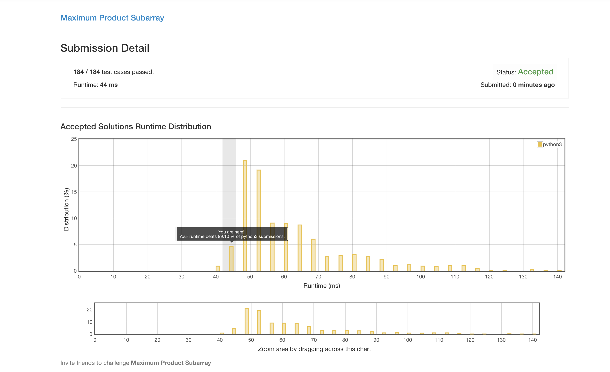
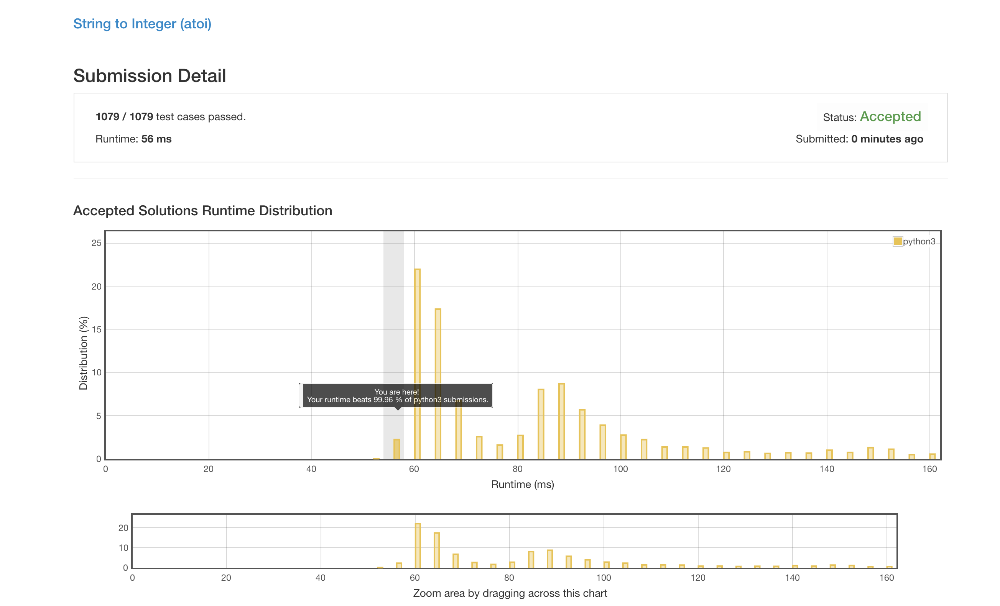

# 最近

昨天看9神的直播看到5点hhhh(也是醉的不行)，不得不感叹一下09也不是之前那个09了，真的是物是人非啊。  
以上写于2018.10.05。

原计划周更的博客变成了月更2333，不过周期长一点也希望最能够坚持下去吧。这次更新是因为发现上课会学到很多CV的知识，想要系统性的整理一下。以下进入正题。
# 小小的装一个逼（虽然没有人看）

 Maximum Product Subarray

 String to Integer (atoi)

# 一些关于CV的笔记

## Some concepts
* **HOG(Histogram of Gradient):**This algorithm collect gradient information at a small region center on every feature point of and vote to decide the direction of the feature point. It is a very basic idea and you can find introduce in the SIFT page.
* **SIFT(Sclae-invariant feature transform):**This algorithm can extract feature points of a object. It is a amazing algorithm, you can find explict explanation in this <a href='https://cle.koan.osaka-u.ac.jp/webapps/blackboard/execute/content/file?cmd=view&content_id=_754106_1&course_id=_164779_1'>page</a>.
* **Shape Context:**It is a algorithm that can calculate similarity between two graph, and it is easy to understand beside formula in this <a href='https://blog.csdn.net/chishuideyu/article/details/74224083'>page</a>.
* **Canny algorithm:**It is also used for edge detection and is quite complicated, you can find more details in <a href='https://algorithm.joho.info/image-processing/canny-edge-detecter/'>page</a>.
* **Prewitt filter:**Used for edge detection, and can be found in <a href='https://algorithm.joho.info/image-processing/prewitt-filter/'>page</a>. The performance is worse than Sober filter.
* **Sober filter:**Used for edge detection, and can be found in <a href='https://algorithm.joho.info/image-processing/sobel-filter/'>page</a>.
* **DoG(Difference of Gaussian):**It is the difference between two image filtered by Gaussian filter with different variance. Click <a href='https://algorithm.joho.info/image-processing/difference-of-gaussian-filter/'>here</a>.
* **LoG Filter(Laplacian Of Gaussian Filter):**Is is a combination of LF and GF, some details can be found in this <a href='https://algorithm.joho.info/image-processing/laplacian-of-gaussian-filter/'>page</a>
* **Convolution integral:**You can check this <a href='https://www.yukisako.xyz/entry/tatamikomi'>page</a> if you can read japanese.
* **Laplacian Filter:**Always be used to detect edge and may increase noise, kernel and formula derivation can be found in this <a href='https://algorithm.joho.info/image-processing/laplacian-filter/'>page</a>.
* **Gaussian Filter:**Always be used to smooth image and can decrease noise, some princepal and formula can be found in this <a href='https://algorithm.joho.info/image-processing/gaussian-filter/'>page</a>.
* **Deconvolution:**How to deconvolution while convolution kernel is known can be found in this <a href='https://blog.csdn.net/panglinzhuo/article/details/75207855'>page</a>.
* **Laplacian Operator**=fxx+fyy
